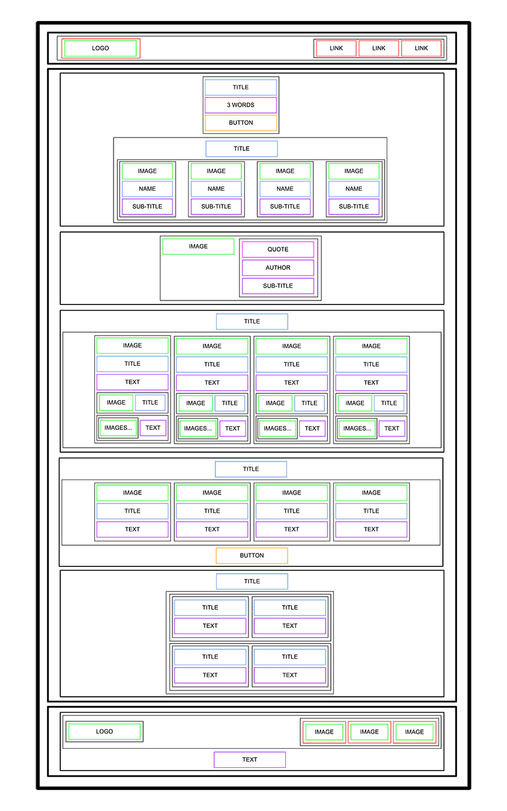

Implementing a webpage from scrath from adesigner file. 
This first project is focused on the HTML structure only - no CSS, no style -just pure HTML semantic. The designer file is available on Figma. 

Here's an image showing the webpage.

